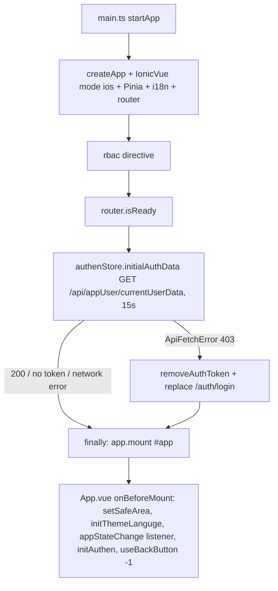
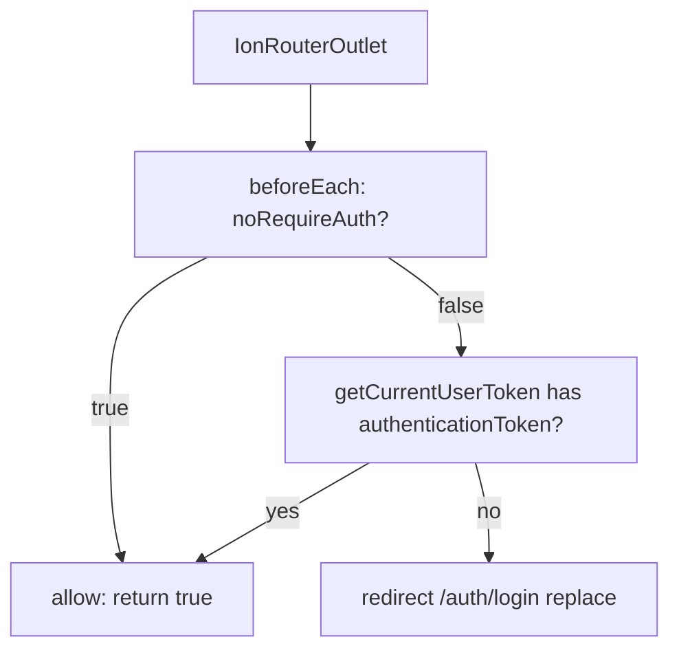

# MOBILE_ARCHITECTURE — Actual Implementation

Reviewed against `main` at commit `8c4868d` (2026-09-24). This page records source
structure; implementation rules live in `AGENTS.md` and `skills/mobile/`.

## Source ownership map (VERIFIED)

| Layer | Main files | Responsibility shown by source |
| ----- | ---------- | ------------------------------ |
| Bootstrap | `src/main.ts` › `startApp`, `src/App.vue` › `onBeforeMount` | Create Vue/Ionic/Pinia/router, restore auth before mount, initialize app listeners and root outlet |
| Routes | `src/router/index.ts:4-255`, `src/pages/` | Route records, public-route metadata, auth guard, page entry points |
| Shared UI | `src/components/base/`, `src/assets/css/` | Standard page wrapper and reusable controls/theme |
| State | `src/stores/` | Auth, app permissions, device state, notifications, tabs, utilities |
| Behavior | `src/composables/` | Auth/session, navigation helpers, device/plugin wrappers, data fetch, file flows |
| Transport | `src/api/*Service.ts` or direct `useApi()` callers, `src/composables/useApi.ts` | Endpoint methods; fetch client with headers, 401 refresh, UI errors |
| Data contracts | `src/types/`, `src/libs/constant.ts`, `src/utils/StorageUtil.ts` | Frontend DTOs, keys/constants, Preferences access |
| Localization | `src/locales/en/`, `src/locales/th/`, `src/plugins/I18n.ts` | Message catalogs and i18n initialization |

`src/pages/example/` contains demonstrations. Follow imports from the target
route/component to tell whether a helper is used in the app flow.

## Startup (VERIFIED)



The router guard is registered when the module loads; `app.use(router)`
precedes `router.isReady` and `initialAuthData()`. An initial navigation may
evaluate the guard before auth restoration
(`src/main.ts` › `startApp`, `src/router/index.ts:237-254`).

## Router + guard (VERIFIED)



Tabs `/tabs/` → `home/chat/other`. Public: ``, `/auth/login`,
`/auth/forgot-password`, `/settings/languge`, `/settings/appearance`,
`/test`, 404.

## Auth + API (VERIFIED)

Signin (`useAuthen.singinProcess`) → Preferences per-user tokens → `useApi`
attaches Bearer/X-User-ID/Locale → 401 shared refresh
(`POST /api/auth/refreshTokenApi`) → retry; refresh-403 → remove token +
login redirect. An ordinary 403 rejects (`src/composables/useApi.ts:331-373`).
Signout → FCM unsubscribe → server signout → clear + `location.replace('/')`.

`src/api/*Service.ts` (and direct callers such as `usePageFetch`,
`authenStore`) call `useApi()` and pass API/CDN `baseURL` per request — no shared mutable defaults (see `skills/mobile/API.md` §1).

## Files and media (VERIFIED source usage)

```text
BaseChoosePhoto / file-picker example
  → useFileSystem (Camera getPhoto/pickImages → ChoosePhotoItem)
  → consuming page/component
  → useUpload (File → FormData chunks → CDN uploadChunkApi → mergeChunkApi)
```

`src/components/base/BaseChoosePhoto.vue` and
`src/pages/example/ui/file-picker.vue` use this path (`useFileSystem`).
`src/composables/useCamera.ts` has photo/video helpers and HEIC conversion,
but no `src/` import caller at this review. `useFileDownload.ts` owns
download/open/share (also used by `BaseFileView`, `BasePdfView`,
`BaseImageView`), while `useFileSystem.ts` owns gallery saving (browser
download on web). Remote image/PDF display goes through
`FileManagerService.fethCdnData` with blob URLs released by `useBlobUrls`.
The upload default is 1 MB chunks and one attempt (`useUpload.ts:14-15`);
options can override it. Backend guarantees are not established here.

## Storage / plugins / lifecycle (VERIFIED)

- Storage: Preferences only (`StorageUtil`), preserved keys on clear.
- Plugin calls use composable wrappers; inspect each operation's web support.
  Push registration is gated; Camera and Preferences have web paths.
- `appStateChange` → `deviceStore`; for new cached-page re-entry behavior,
  use Ionic view hooks and owned cleanup. No current page imports view hooks.
  Background execution is not guaranteed.

Android/iOS packages are declared, but native project directories are not
committed. Source and Capacitor config establish intended code paths; they do
not establish device behavior.
