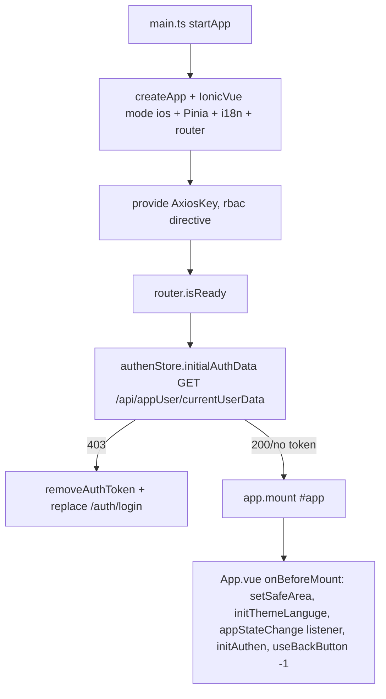
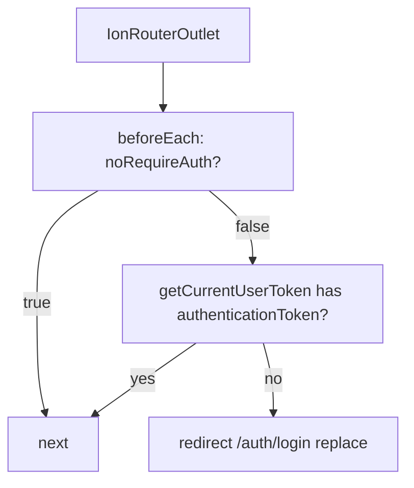

# MOBILE_ARCHITECTURE — Actual Implementation

## Startup (VERIFIED)

## Router + guard (VERIFIED)

Tabs `/tabs/` → `home/chat/other`. Public: ``, `/auth/login`,
`/auth/forgot-password`, `/settings/languge`, `/settings/appearance`,
`/test`, 404.

## Auth + API (VERIFIED)

Signin (`useAuthen.singinProcess`) → Preferences per-user tokens → request
interceptor attaches Bearer/X-User-ID/Locale → 401 refresh queue
(`POST /api/auth/refreshToken`) → replay; 403 → logout + login redirect.
Signout → FCM unsubscribe → server signout → clear + `location.replace('/')`.

## Storage / plugins / lifecycle (VERIFIED)

- Storage: Preferences only (`StorageUtil`), preserved keys on clear.
- Plugins behind `useDevice().isWeb()` guards; wrappers in composables.
- `appStateChange` → `deviceStore`; cached Ionic pages need view-enter
  refresh + leave cleanup; background execution not guaranteed.
